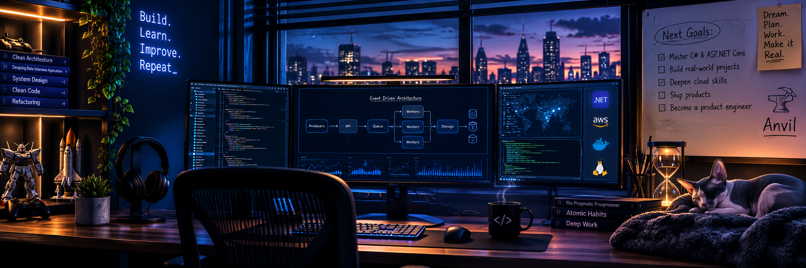

<!-- ═══════════════════════════════════════════════════════════════════════ -->
<!--                               B A N N E R                                -->
<!-- ═══════════════════════════════════════════════════════════════════════ -->

  

  

<!-- ═══════════════════════════════════════════════════════════════════════ -->
<!--                                 H E R O                                  -->
<!-- ═══════════════════════════════════════════════════════════════════════ -->

# Dean Stark

 

<code>Building reliable backend systems that businesses depend on.</code>

  

&nbsp;
&nbsp;

  

 

<!-- ═══════════════════════════════════════════════════════════════════════ -->
<!--                                A B O U T                                 -->
<!-- ═══════════════════════════════════════════════════════════════════════ -->

## &nbsp;About

I build the parts of software that stay invisible when they work — APIs, data models, background processing, and the infrastructure that quietly holds a product together under real load. What draws me to backend engineering isn't the tooling; it's the responsibility. When a system is dependable, an entire business can be built on top of it without anyone thinking twice.

I've spent my time learning *why* systems are built the way they are — how they fail, how they recover, and how they keep earning trust as they grow. Today I work primarily in **TypeScript** and **Node.js** while moving deliberately into the **C# / .NET** ecosystem, treating each project as a step toward the same goal: software that solves a real operational problem, not a demo.

 

 

<!-- ═══════════════════════════════════════════════════════════════════════ -->
<!--                   E N G I N E E R I N G   P H I L O S O P H Y            -->
<!-- ═══════════════════════════════════════════════════════════════════════ -->

## &nbsp;Engineering Philosophy

<table width="100%">
<tr>
<td width="33%" valign="top">

**Reliability is a feature**

The most important thing a system can do is behave predictably — especially when something goes wrong. I design for failure and recovery first, because that's what earns trust over time.

</td>
<td width="33%" valign="top">

**Understand before you build**

I'd rather fully understand a system than assemble one I can't reason about. Depth in the fundamentals compounds; every shortcut eventually asks for its interest back.

</td>
<td width="33%" valign="top">

**Software serves the business**

Code is a means, not the point. The best architecture is the one that keeps solving a real problem — and keeps delivering value long after it ships.

</td>
</tr>
</table>

 

 

<!-- ═══════════════════════════════════════════════════════════════════════ -->
<!--                        C U R R E N T   M I S S I O N                     -->
<!-- ═══════════════════════════════════════════════════════════════════════ -->

## &nbsp;Current Mission

Becoming an engineer who ships **products**, not just code.

I'm building production-grade backend systems while expanding into the **C# / .NET / Azure** stack — closing the distance between *"can build software"* and *"can build software a business runs on."* This chapter is about fluency across a second major backend ecosystem and the cloud-native architecture behind systems that scale.

 

 

<!-- ═══════════════════════════════════════════════════════════════════════ -->
<!--                      C O R E   T E C H N O L O G I E S                   -->
<!-- ═══════════════════════════════════════════════════════════════════════ -->

## &nbsp;Core Technologies

 

**LANGUAGES &amp; RUNTIME**

  

**APIs &amp; DATA**

  

**INFRASTRUCTURE &amp; CLOUD**

 

 

 

<!-- ═══════════════════════════════════════════════════════════════════════ -->
<!--                      F E A T U R E D   P R O J E C T                     -->
<!-- ═══════════════════════════════════════════════════════════════════════ -->

## &nbsp;Featured Project

<table width="100%">
<tr>
<td valign="top">

<h3>&nbsp;Anvil&nbsp; </h3>

&nbsp;An **event-driven backend platform** built to handle the hard part of production systems: processing events reliably when things fail. Durable workflows, background workers, and recovery that doesn't lose data under pressure.

<table width="100%">
<tr>
<td width="50%" valign="top">

&nbsp;**Engineering highlights**

&nbsp;• Event lifecycle management
&nbsp;• Background worker processing
&nbsp;• Retry &amp; failure recovery
&nbsp;• File processing pipelines

</td>
<td width="50%" valign="top">

&nbsp;**Production mindset**

&nbsp;• Designed for failure &amp; recovery
&nbsp;• Containerized &amp; reproducible
&nbsp;• Environment-based configuration
&nbsp;• Data integrity under load

</td>
</tr>
</table>

&nbsp;**Stack**&nbsp;&nbsp;

 

🔒&nbsp; Repository opening soon — currently hardening for a public release.

</td>
</tr>
</table>

 

 

<!-- ═══════════════════════════════════════════════════════════════════════ -->
<!--                        G I T H U B   A N A L Y T I C S                   -->
<!-- ═══════════════════════════════════════════════════════════════════════ -->

## &nbsp;GitHub Analytics

 

  

 

 

<!-- ═══════════════════════════════════════════════════════════════════════ -->
<!--                       W H A T   I ' M   L E A R N I N G                  -->
<!-- ═══════════════════════════════════════════════════════════════════════ -->

## &nbsp;Sharpening Next

<table width="100%">
<tr>
<td width="50%" valign="top">

&nbsp;**The stack**

</td>
<td width="50%" valign="top">

&nbsp;**The intent**

Working through the **Microsoft Back-End Developer Professional Certificate** while going deeper on cloud infrastructure and software architecture — the fundamentals behind systems that scale.

</td>
</tr>
</table>

 

 

<!-- ═══════════════════════════════════════════════════════════════════════ -->
<!--                          F U T U R E   V I S I O N                       -->
<!-- ═══════════════════════════════════════════════════════════════════════ -->

## &nbsp;Where I'm Headed

Becoming a **product engineer and entrepreneur** — building the software that solves real operational problems, from the schema to the business it serves.

 

`Backend Engineering`&nbsp;&nbsp;`Distributed Systems`&nbsp;&nbsp;`Software Architecture`&nbsp;&nbsp;`Cloud`&nbsp;&nbsp;`Product`

 

 

<!-- ═══════════════════════════════════════════════════════════════════════ -->
<!--                              F O O T E R                                 -->
<!-- ═══════════════════════════════════════════════════════════════════════ -->

  

**Reliable systems. Real business value. Built to last.**

Let's build something worth depending on.

  

&nbsp;
&nbsp;

  

